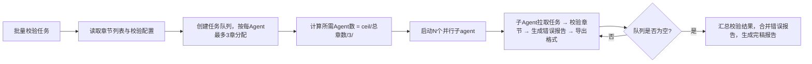

## 网文完稿校验

### 触发关键词
小说写完了帮我检查下、导出适合起点/番茄的格式、查有没有错别字、检测敏感词、整理成发布版本、帮我导出小说发布格式、检查小说错别字、敏感词检测、小说完稿检查、适配起点格式导出、番茄小说格式导出、小说排版整理、多平台格式导出、小说完稿导出

### 核心功能
1. 错别字、标点符号、语法错误检查
2. 敏感内容、违规内容排查
3. 格式规范统一：章节标题、段落格式、标点规范
4. 全文字数统计、完稿报告生成
5. 适配不同平台发布格式导出
6. 批量替换功能
7. 自动分段功能

> **Skill 边界说明**：技术性文字校验（错别字/标点/语法）由本 Skill 负责，`sumeru-polish` Skill 专注于文笔和内容层面的优化，两者互补不重叠。用户在润色后仍应通过 finalize 进行最终技术校验。

### 处理边界
- 可以修正错别字、标点、段落格式、章节标题格式和明显语病。
- 可以给出敏感内容替换建议，必要时生成合规化改写版本。
- 不改变剧情事实、人物关系、伏笔状态和章节结尾钩子。
- 发现剧情硬伤时记录到 `.sumeru/finalize/logic-notes.json`，建议回到 `sumeru-review` 或 `sumeru-write` 处理。

### 独立调用自举
如果用户直接调用 `sumeru-finalize`，不要假设 worldbuilder 已运行。先执行 AGENTS.md 的“断点恢复与独立调用自举”：
- 定位项目根目录，读取或生成 `.sumeru/project.json`、`.sumeru/status.json`。
- 根据 `chapters/` 推断可导出章节；若状态缺失，将已有章节标记为至少 `drafted`，并在 release 报告中提示未完整走 review/polish。
- 若缺少 tests 或 issue summary，不阻塞技术校验；生成 `tests/release-check-report.md` 并标注“缺少审查测试历史”。
- 若缺少当前范围的 `finalize-<range>.md` context pack，先生成临时 context pack 再校验/导出。
- build 完成后更新 `.sumeru/finalize/build-manifest.json`、`.sumeru/status.json`、`.sumeru/cache/latest-test-summary.md`。

### 按模式导出
- `short/light`：默认导出 `publish.md` 或单篇发布稿，做错别字、标点、敏感词和基础排版检查。
- `medium/standard`：导出全文和分章版本，生成 `publish/` 和一份 release 检查报告。
- `long/full`：执行完整 build/release，生成 `publish/`、`tests/release-check-report.md`、`.sumeru/finalize/build-manifest.json`。

### Build 前检查
- 读取 `.sumeru/status.json`，默认只导出状态为 `finalized` 的章节；用户明确要求时可导出 `polished` 章节，但必须在 release 报告中标注风险。
- 检查 `chapters/` 是否缺章、重章、命名不规范。
- 检查正文是否包含 `TODO`、`FIXME`、未替换占位符或明显元数据残留。
- 检查 `.sumeru/issues/index.json` 是否存在未关闭的 `critical` 或 `major` issue。
- 检查 `tests/foreshadowing-report.md` 是否存在关键伏笔未回收。
- 检查 `tests/creativity-report.md` 是否存在严重套路重复、情绪疲劳或创意目标未落地问题。
- 检查 `docs/glossary.md` 中的术语是否出现禁止变体。

### 低 Token Build 规则
- build 前先读取 `.sumeru/cache/latest-test-summary.md`、`.sumeru/cache/issue-brief.md`、`.sumeru/status.json`，不要全文读取所有测试报告。
- `short/light` 不需要 build manifest，除非用户要求正式构建记录。
- `medium/standard` 可生成简化 release 报告，不强制完整 manifest。
- 技术校验可按 10-20 章分片，每个子Agent读取 `finalize-<range>.md` context pack 和目标章节正文。
- 只有检测到风险时才读取对应 `tests/*.md` 或 issue 详情。
- 导出阶段不需要读取 `ideas/`、完整大纲或完整人物设定。
- build 完成后生成或刷新 `.sumeru/finalize/build-manifest.json` 和 `.sumeru/cache/latest-test-summary.md`。

### 子Agent并行校验机制

当需要校验/导出的章节数量大于3章时，自动启用子Agent并行处理模式：

**⚠️ 遵循全局约束：每个子Agent最多负责3个章节**（详见 AGENTS.md "子Agent并行处理规则"）
- 所需Agent数 = ceil(总章节数 / 3)
- 相邻章节分配给同一Agent，保持格式处理一致性

**调度逻辑**

**章节分配规则**
- 按章节顺序连续分配（如Agent1负责第1-3章，Agent2负责第4-6章）
- 尾部不足3章的Agent按实际剩余章节数分配

**每个子Agent的校验范围**
- 错别字、标点、语法错误检查
- 敏感词检测（按三级标准）
- 格式规范统一
- 对应平台格式导出

### 输出内容
- 错误列表：错别字、标点错误、语法问题
- 敏感内容提示：需要调整的违规内容
- 校验后的纯净版全文
- 完稿报告：总字数、章节数、核心内容摘要
- 多平台发布格式版本（起点、番茄、晋江等）
- `tests/release-check-report.md`：build 前检查和风险清单
- `.sumeru/finalize/build-manifest.json`：构建清单，包含输入章节、平台、产物路径、总字数、未解决风险

### 各平台导出格式规则

#### 起点中文网（qidian）
- 章节标题格式：`第X章 标题内容`，居中对齐
- 段落首行缩进2字符
- 每段空一行
- 标点符号使用中文全角
- 章节字数建议3000-5000字
- 禁止使用特殊符号作为章节标题
- 对话单独成段

#### 番茄小说（fanqie）
- 章节标题格式：`第X章 标题内容`
- 段落首行不缩进，段落间空一行
- 每句尽量简短，适合移动端阅读
- 章节字数建议2000-3000字
- 重点内容可使用加粗标记
- 对话使用引号包裹，说话人单独成段或句尾注明

#### 晋江文学城（jjwxc）
- 章节标题格式：`第X章 标题内容`
- 支持HTML格式标签
- 段落首行缩进2字符
- 章节字数建议2500-4000字
- 作者有话要说区域单独设置
- 支持章节提要

#### 纵横中文网（zongheng）
- 章节标题格式：`第X章 标题内容`
- 段落首行缩进2字符
- 章节字数建议3000-6000字
- 支持分卷设置
- 标点规范使用中文全角

#### 17K小说网（17k）
- 章节标题格式：`第X章 标题内容`
- 段落首行缩进2字符
- 章节字数建议2000-4000字
- 支持章节预览
- 每章结束可设置下章预告

### 敏感词检测标准

#### 一级敏感（必须修改）
- 违反国家法律法规的内容
- 涉及政治敏感人物、事件
- 色情、淫秽描写
- 暴力、恐怖内容
- 分裂国家、破坏民族团结言论
- 宗教极端内容

#### 二级敏感（建议修改）
- 过于血腥暴力的细节描写
- 低俗用语、粗口
- 可能引起不适的医疗描写
- 涉及未成年人的不当内容
- 赌博、毒品相关描写
- 侵犯他人隐私的内容

#### 三级敏感（优化建议）
- 网络用语过多影响阅读
- 容易产生歧义的表述
- 可能引起争议的话题
- 过度使用网络热梗
- 重复冗余的表述

### 错误分级提示

#### 严重错误（红色标记）
- 错别字导致语义完全改变
- 敏感词一级违规内容
- 章节标题格式完全不符合规范
- 段落结构严重混乱
- 标点符号大面积错误

#### 中等错误（黄色标记）
- 一般错别字
- 标点符号使用不规范
- 敏感词二级内容
- 段落格式不统一
- 语法错误影响理解

#### 轻微错误（蓝色标记）
- 建议优化的用词
- 标点符号使用可以更规范
- 敏感词三级内容
- 段落排版可进一步美化
- 重复性表述建议

### 批量替换功能说明

#### 功能特性
- 支持全局批量替换指定词汇
- 支持正则表达式替换
- 支持替换前预览确认
- 支持多组替换规则同时执行
- 支持替换历史记录查询

#### 使用场景
1. 角色名统一修改
2. 地名、设定名称批量调整
3. 敏感词批量替换
4. 标点符号统一规范
5. 网络用语批量转换

#### 操作方式
- 预设规则：选择常用替换规则模板
- 自定义规则：手动输入查找内容和替换内容
- 正则模式：使用正则表达式进行复杂匹配
- 确认替换：查看替换预览后确认执行

### 自动分段功能说明

#### 功能特性
- 智能识别对话与叙述内容
- 根据句子长度自动分段
- 支持自定义分段字数阈值
- 保持段落逻辑完整性
- 对话自动单独成段

#### 分段规则
1. 对话优先：对话内容自动单独成段
2. 字数控制：单段建议100-300字
3. 逻辑完整：避免在句子中间分段
4. 场景切换：场景转换时自动分段
5. 心理活动：大段心理描写适当分段

#### 可配置参数
- 最大段落字数（默认300字）
- 最小段落字数（默认50字）
- 是否强制对话单独成段
- 是否在场景切换时加分隔线
- 是否保留原有分段结构

### 数据持久化
完稿数据自动保存到 `.sumeru/finalize/` 目录：
- `clean/full-text.md`：校验后的纯净版全文
- `clean/chapters/`：按章节拆分的纯净版文件
- `error-report.json`：错误列表，含错别字、标点、敏感词等所有问题
- `stats.json`：完稿统计报告，总字数、章节数、平均章节长度等
- `export-config.json`：各平台导出配置参数
- `build-manifest.json`：发布构建清单

**用户可见输出（当前工作目录）**：
- `publish/`：各平台导出版本，按平台名分类存放
- `tests/release-check-report.md`：发布前检查报告

#### 与其他 Skill 配合
- **前置 Skill**：读取最终章节内容
   - 默认从 `chapters/` 读取最新章节内容（review 修复和 polish 润色直接修改 chapters/，无需额外操作）

#### 数据复用
- 可随时重新导出其他平台格式，无需重新校验
- 错误报告可作为后续写作的规避参考
- 支持增量导出，修改部分章节后仅重新生成对应章节的平台版本
