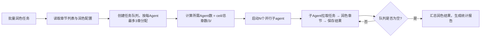

## 网文内容润色

### 触发关键词
帮我润色这段小说、改下文笔、优化章节节奏、强化这个爽点、让对话更自然、把这段写得更爽、优化小说文笔、调整章节节奏、让对话更真实、帮我改下这段内容、润色小说、优化爽点、提升文笔、让这段更有代入感、小说内容优化、文笔润色

### 核心功能

### 独立调用自举
如果用户直接调用 `sumeru-polish`，不要假设 worldbuilder 已运行。先执行 AGENTS.md 的“断点恢复与独立调用自举”：
- 定位项目根目录，读取或生成 `.sumeru/project.json`、`.sumeru/status.json`。
- 根据用户指定范围或 `chapters/` 推断要润色的章节。
- 若缺少 review 输出，不阻塞润色；只基于正文、style cache 和用户要求润色，并在 `.sumeru/backlog.md` 记录“未经过 review”。
- 若缺少 `docs/style-guide.md` 或 `.sumeru/cache/style-brief.md`，根据项目配置和现有章节生成临时风格摘要。
- 若缺少当前范围的 `polish-<range>.md` context pack，先生成临时 context pack 再润色。
- 润色完成后备份原文，更新 `.sumeru/status.json`、`.sumeru/polish/summary.json`、`.sumeru/cache/continuity-brief.md`。

### 按模式润色
- `short/light`：优先润色 `story.md` 全文或用户指定片段，输出可直接发布的短篇稿；不强制章节化。
- `medium/standard`：按章节或小范围润色，保留 `.sumeru/issues.md` 中的问题处理记录。
- `long/full`：按 context pack 分片润色，每个子Agent 1-3 章，生成 diff/summary 和状态更新。

### 低 Token 润色规则
- 如果存在 `.sumeru/context-packs/polish-<range>.md`，优先只读取 context pack 和目标章节正文。
- `short/light` 不强制 context pack，优先读取 `story.md`、`outline.md` 和 `story-brief.md`。
- `medium/standard` 只在批量或跨章节一致性复杂时生成 context pack。
- 风格依据优先读取 `.sumeru/cache/style-brief.md`，创意依据优先读取 `.sumeru/cache/creative-brief.md`。
- 审查问题优先读取 `.sumeru/cache/issue-brief.md` 和相关 issue，不全文读取所有 tests。
- 批量润色每个子Agent 1-3 章；不要让单个子Agent读取全本章节。
- 润色后只更新对应章节状态、diff/summary 和相关缓存摘要。

#### 润色边界
- 保留既有主线事实、人物关系、战力体系、伏笔状态和章节结尾钩子，除非用户明确要求重写剧情。
- 保留 `outlines/chapters.json` 中每章 `acceptanceCriteria` 已满足的内容，不为了文笔牺牲验收标准。
- 强化但不篡改 `creativeGoal`、`emotionalBeat`、`readerMemoryPoint` 和 `freshnessHook`。
- 术语、人物名、地名、组织名、功法名必须遵守 `docs/glossary.md`，不得产生新变体。
- 文风、句式、禁用表达、平台偏好必须遵守 `docs/style-guide.md`。
- 轻度润色以表达优化为主，不改变段落顺序和剧情信息。
- 中度润色可以调整段落组织、补充细节和强化情绪递进，但不新增会影响后文的重大设定。
- 深度润色可以重构场景呈现方式，但必须保持章节核心事件、人物动机和结尾指向一致。
- 发现剧情逻辑硬伤时不要在润色中擅自改主线，应记录到 `.sumeru/polish/logic-notes.json`，建议转交 `sumeru-review` 或 `sumeru-write`。

#### 润色等级
1. **轻度润色**：优化句式表达，去除冗余表述，精炼用词，提升文字流畅度，保留80%以上原文风格和表达方式
2. **中度润色**：重构段落结构，优化叙事视角，全面提升文笔质感，保留60%原文核心表达
3. **深度润色**：逐字打磨，雕琢细节，追求最佳阅读体验，保留核心情节脉络

#### 风格适配选项
- **小白爽文**：短句为主，节奏明快，情绪直接，用词通俗易懂
- **精品文**：句式多变，文笔细腻，注重氛围营造，人物心理刻画深入
- **古风仙侠**：用词雅致，意境悠远，适当运用古典词汇和修辞手法
- **都市现实**：语言生活化，对话接地气，场景描写真实可感
- **悬疑推理**：语言凝练，节奏紧凑，信息密度适中，悬念感强
- **科幻未来**：科技感词汇准确，逻辑严密，世界观表述清晰

#### 针对性优化
1. **节奏收紧**
   - 删除无效铺垫：去除与主线无关的场景描写、心理活动
   - 压缩过渡情节：将冗长的转场、交代性文字缩短30%-50%
   - 加快信息传递：采用对话、行动展现信息，减少大段叙述
   - 调整段落长度：将超长段落拆分为2-3行的短段落，提升阅读速度

2. **爽点强化**
   - **前置铺垫**：在爽点前300-500字设置期待感，通过反派挑衅、主角困境、他人质疑等方式铺垫
   - **情绪递进**：爽点爆发分三层：期待→紧张→释放，每一层情绪都要有具体描写
   - **细节放大**：主角行动、他人反应、环境变化三个维度同时描写，增强画面感
   - **收尾有力**：爽点后用100-200字总结效果，或留下新的钩子
   - **经典结构**：[压抑/挑衅]→[蓄力/准备]→[爆发/打脸]→[余波/影响]

3. **对话优化**
   - **人设贴合**：每句对话符合人物年龄、身份、性格，避免千人一面
   - **潜台词**：重要对话包含言外之意，通过语气、动作辅助表达
   - **节奏控制**：长段对话拆分为多轮，穿插动作、表情、心理描写
   - **信息传递**：通过对话自然交代背景、推动情节，避免生硬说明
   - **口语化**：减少书面语，多用真实生活中的表达习惯，但避免语病
   - **对话标签优化**：用具体动作代替"说"、"道"，如"挑眉道"、"冷哼一声"

4. **文笔优化**
   - **精准用词**：替换重复词汇、模糊表达，选用更准确的动词、形容词
   - **句式变化**：长短句结合，避免清一色的主谓宾结构
   - **感官描写**：调动视觉、听觉、嗅觉、触觉、味觉，增强代入感
   - **比喻具象**：用读者熟悉的事物作比，避免抽象、生僻的比喻
   - **去除冗余**：删除"非常"、"十分"、"很"等副词，用动词和名词表达程度

### 输出内容
- 润色后的完整章节内容（直接替换 `chapters/` 中的原文件）
- 润色修改说明：调整的地方与原因（按优化类型分类说明）
- 优化建议：后续内容写作提升方向，具体可操作的技巧

### 子Agent并行润色机制

当需要润色的章节数量大于3章时，自动启用子Agent并行润色模式：

**⚠️ 遵循全局约束：每个子Agent最多负责3个章节**（详见 AGENTS.md "子Agent并行处理规则"）
- 所需Agent数 = ceil(总章节数 / 3)
- 相邻章节分配给同一Agent，保持风格连贯性

**调度逻辑**

**子Agent输入上下文**
每个子agent接收：
1. 润色等级与风格参数
2. 负责章节的原始内容
3. 世界观设定（精简版，保持术语一致）
4. 人物设定（仅相关人物，保持性格一致）
5. 审查问题清单（如有，作为重点优化方向）
6. `docs/creative-strategy.md`、`docs/style-guide.md` 与 `docs/glossary.md`
7. 对应章节任务卡的 `acceptanceCriteria`、`emotionalBeat`、`readerMemoryPoint`

### 创意强化方式
- **名场面放大**：用动作、反应、环境和短句节奏强化读者记忆点。
- **情绪递进**：确保情绪不是平铺直叙，而是有压抑、转折、释放或余韵。
- **台词打磨**：关键台词追求短、准、有角色辨识度，可截图传播。
- **结尾钩子**：强化章节最后 100-200 字，让读者明确想看下一章。
- **反套路保护**：如果原文已经避开套路，不要润色回模板化写法。

**章节分配规则**
- 按章节顺序连续分配（如Agent1负责第1-3章，Agent2负责第4-6章）
- 尾部不足3章的Agent按实际剩余章节数分配

**进度追踪**
- 每个Agent完成润色后立即将结果直接保存到 `chapters/`（修改前自动备份到 `.sumeru/write/original/`）
- 实时显示已完成/进行中/待润色章节状态
- 所有Agent完成后，润色结果已直接应用到 `chapters/` 目录
- 润色完成后更新 `.sumeru/status.json` 中对应章节状态为 `polished`

### 数据持久化
润色过程数据自动保存到 `.sumeru/polish/` 目录：
- `diff/`：修改对比文件，记录每处修改的位置、原文、修改后内容、修改原因
- `summary.json`：润色统计报告，包含修改数量、优化类型分布、字数变化
- `style-config.json`：本次润色使用的风格、等级、重点参数配置

#### 与其他 Skill 配合
- **前置 Skill**：读取 `sumeru-write` 和 `sumeru-review` 的输出
  - 从 `chapters/` 读取原始章节内容
  - 从 `.sumeru/issues/index.json`、`.sumeru/review/fix-plan.json` 和 `tests/*.md` 读取审查问题作为优化重点
- **后续 Skill**：润色后的内容供 `sumeru-finalize` 使用
  - 润色结果直接保存在 `chapters/` 目录，无需额外应用步骤
  - worldbuilder 编排 polish 时，润色结果自动生效

#### 数据复用
- 支持多轮润色，可基于上一轮润色结果继续优化
- 可导出diff文件用于人工审核修改内容
- 风格配置可复用，保持全本润色风格统一
