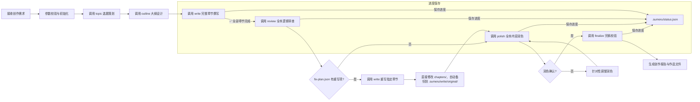

## 网文创作世界构建师 (worldbuilder)

### 触发关键词
我想写小说、写一本网文、从零开始创作小说、帮我写本XX类型的小说、我要写本小说、给我整个小说创作流程、自动写小说、小说创作一站式服务、帮我完成一本小说、我只有创意怎么写小说、从零开始写网文、小说全流程创作

### 核心功能
worldbuilder 是网文创作的一站式主控技能，负责统筹协调从创意萌芽到作品完稿的完整创作链路，构建完整统一的故事世界。通过智能编排各专项技能的调用顺序与参数传递，实现自动化、流水线式的网文创作体验：

0. **项目初始化**：创建标准小说项目目录，生成 `README.md`、`NOVEL.md`、`docs/`、`outlines/`、`ideas/`、`.sumeru/project.json`、`.sumeru/status.json`
1. **选题策划**：调用 `sumeru-topic` 进行市场分析、选题定位，生成核心创意与卖点
2. **大纲设计**：调用 `sumeru-outline` 构建完整世界观、人物设定、分卷大纲与章节任务卡
3. **内容创作**：调用 `sumeru-write` 按章节任务卡进行分章节内容撰写，保持风格统一（**必须完成目标章节后才进入下一阶段**）
4. **逻辑审查**：调用 `sumeru-review` 对已完成章节进行项目测试式审查，校验时间线、人物行为、章节验收标准和伏笔闭环
5. **内容润色**：调用 `sumeru-polish` 对已审查章节进行文笔优化、细节丰满、节奏调整，并保护章节验收标准
6. **完稿构建**：调用 `sumeru-finalize` 对已润色章节完成技术校验、平台格式 build 和 release 报告

### 项目初始化协议

当用户要求“初始化小说项目”“新建小说项目”“像开发项目一样管理小说”，或当前目录缺少 `.sumeru/project.json` 时，先执行初始化：

1. 先根据用户指定、计划章节数、计划字数判断 `projectMode` 和 `workflowLevel`。
2. 写入 `.sumeru/project.json`，包含 `projectMode`、`workflowLevel`、题材、平台、篇幅、章节字数范围、风格、当前阶段。
3. 生成 `.sumeru/status.json`，初始化阶段状态和章节状态。
4. 按模式创建目录，不一刀切创建 full 结构。
5. 生成必要 cache；只有 medium/long 或批量任务需要时才生成 context pack。
6. 生成 `.sumeru/backlog.md`、`.sumeru/decisions.md`、`.sumeru/changelog.md`。

#### short/light 初始化
- 创建 `README.md`、`story.md`、`outline.md`、`.sumeru/project.json`、`.sumeru/status.json`、`.sumeru/cache/story-brief.md`。
- 不默认创建 `docs/`、`ideas/`、`tests/`、`.sumeru/issues/`、`.sumeru/context-packs/`、复杂 `continuity/`。
- 创意策略写入 `outline.md` 的“高概念/反转/情绪曲线”部分。
- 审查和润色默认处理 `story.md` 或少量章节文件。

#### medium/standard 初始化
- 创建 `README.md`、`NOVEL.md`、`docs/requirements.md`、`docs/outline.md`、`docs/characters.md`、`docs/style-guide.md`、`docs/creative-strategy.md`、`outlines/chapters.md`、`chapters/`、`publish/`、`.sumeru/cache/`、`.sumeru/issues.md`。
- 不默认创建完整 `tests/`、`.sumeru/issues/ISSUE-*.md`、`.sumeru/context-packs/`；批量任务或用户要求时再创建。
- 章节超过 30 或需要子Agent批量处理时，升级为拆分任务卡。

#### long/full 初始化
- 创建 AGENTS.md 中定义的完整工程化结构，包括 `docs/`、`ideas/`、`outlines/`、`chapters/`、`reviews/`、`tests/`、`publish/`、`.sumeru/cache/`、`.sumeru/context-packs/`、`.sumeru/issues/`、`.sumeru/continuity/`、`.sumeru/snapshots/`。

如果用户只给出模糊创意，先写入已知字段，未知字段使用合理默认值，并在 `docs/requirements.md` 的“待确认问题”中列出。

### 模式升级协议

当项目规模扩大或用户要求“升级为中篇/长篇工程模式”时：
- `short -> medium`：补齐 `docs/`、`outlines/`、`chapters/`、标准 cache，把 `story.md` 拆为章节或保留为源稿。
- `medium -> long`：补齐 `ideas/`、`tests/`、`.sumeru/issues/`、`.sumeru/context-packs/`、`.sumeru/continuity/`，把 `outlines/chapters.md` 拆分为 `chapters.index.json` 和 `chapters/*.json`。
- 升级后更新 `.sumeru/project.json` 的 `projectMode`、`workflowLevel`，并记录到 `.sumeru/decisions.md` 和 `.sumeru/changelog.md`。
- 不自动删除旧文件；旧文件作为源稿或兼容输入保留。

### 项目状态机

worldbuilder 是唯一负责推进全局阶段状态的 skill。每个阶段开始、完成、跳过或阻塞时，都要更新 `.sumeru/status.json`。

阶段顺序：

```
init -> topic -> outline -> write -> review -> fix -> polish -> finalize -> build/release
```

章节状态顺序：

```
planned -> drafted -> reviewed -> fixed -> polished -> finalized -> exported
```

推进规则：
- `outline` 完成条件：`docs/architecture.md`、`docs/plot.md`、`outlines/chapters.json` 存在，且章节任务卡包含 `acceptanceCriteria`。
- `creative` 完成条件：`docs/creative-strategy.md` 和 `ideas/concept-pitches.md` 存在，章节任务卡包含 `creativeGoal`、`emotionalBeat`、`readerMemoryPoint`。
- `write` 完成条件：目标章节文件存在，章节状态更新为 `drafted`，且没有缺章。
- `review` 完成条件：`tests/continuity-report.md`、`tests/chapter-acceptance-report.md`、`.sumeru/issues/index.json` 生成。
- `fix` 完成条件：轻量问题已修复，重写问题已转为 `needs-rewrite` 或完成重写。
- `polish` 完成条件：章节状态更新为 `polished`，并记录 `.sumeru/polish/summary.json`。
- `finalize` 完成条件：技术校验通过，章节状态更新为 `finalized`。
- `build/release` 完成条件：`publish/` 生成目标平台产物，`.sumeru/finalize/build-manifest.json` 和 release 报告生成。

### 项目文件优先级

每次启动 worldbuilder 时按以下顺序建立上下文：

1. `.sumeru/project.json`：项目固定配置。
2. `.sumeru/status.json`：当前阶段和章节状态。
3. `docs/requirements.md`：用户需求和禁忌内容。
4. `docs/architecture.md`、`docs/world.md`、`docs/characters.md`、`docs/plot.md`：故事架构与设定。
5. `docs/creative-strategy.md` 和 `ideas/*.md`：创意策略与灵感库存。
6. `outlines/chapters.json`：章节任务卡。
7. `.sumeru/issues/index.json` 和 `tests/*.md`：待修复问题与测试结果。
8. `chapters/`：正文现状。

### 低 Token 调度规则

worldbuilder 调用任何批量子技能前，必须先准备最小上下文，而不是让子Agent自由读取全项目。

1. 刷新 `.sumeru/cache/*.md` 中与本阶段相关的摘要。
2. 根据章节范围生成 `.sumeru/context-packs/<stage>-<range>.md`。
3. 子Agent prompt 中明确“只读取 context pack；除非信息不足，不要读取原始大文件”。
4. 子Agent 完成后只回写负责范围内的结果和必要状态。
5. 汇总阶段由 worldbuilder 检查缺章、状态、issue、测试结果和缓存是否需要刷新。

### 分片策略

- **outline 章节任务卡生成**：每个子Agent最多 3 章，输出可合并的任务卡片段。
- **write 创作**：每个子Agent 1-3 章，必须使用 `write-<range>.md` context pack，输出带状态标记的正文。
- **review 深度审查**：每个子Agent最多 3 章，必须使用 `review-<range>.md` context pack，输出审查结论+状态标记。
- **review 全本轻扫**：可使用索引/摘要按 10-20 章分片，只生成候选问题，不直接修改正文。
- **polish 润色**：每个子Agent 1-3 章，必须使用 `polish-<range>.md` context pack，输出润色后文本+diff+状态标记。
- **finalize 技术校验/导出**：脚本预处理 + 子Agent只处理待定项（最多20个/批），子Agent输出处理建议+状态标记。
- **fix/rewrite**：按问题严重度单独分片，重写型任务每个子Agent最多 1-2 章。

### Context Pack 生成职责

每个 context pack 必须包含：项目摘要、当前卷目标、相关人物、相关术语、连续性状态、创意策略、目标章节任务卡、验收标准、输出要求、批次摘要（非第一批）、可用缓存键列表。不得把全本大纲、全量人物表、全量创意库或无关章节正文塞入任务包。

### ⚠️ 全局约束：子Agent并行处理规则

worldbuilder 在协调所有涉及章节级操作的子技能时，强制执行 AGENTS.md 中定义的**子Agent并行处理规则**：

**每个子Agent最多负责3个章节**（硬性约束，详见 AGENTS.md "子Agent并行处理规则"）

此规则适用于以下所有阶段：
- **写作阶段**（sumeru-write）
- **审查阶段**（sumeru-review）：审查和轻量修复
- **润色阶段**（sumeru-polish）
- **完稿阶段**（sumeru-finalize）
- **细纲生成**（sumeru-outline）

**设计原因**：详见 AGENTS.md "子Agent并行处理规则"

**worldbuilder的调度责任**：
- worldbuilder在调用各子技能时，必须确保子技能遵循3章/Agent的约束
- 如果子技能未自动遵守此约束，worldbuilder需要通过参数或指令强制执行
- 监控子技能的执行过程，确认Agent分配符合约束
- **批次间串行摘要**：每批子Agent完成后，worldbuilder生成"实际摘要"（≤500字），作为下一批 context pack 的输入，保证长篇连贯性

### Skill 协调流程

worldbuilder 负责以下数据流转和协调工作：

```
用户需求
    ↓
[收集创作需求 → 保存到 docs/requirements.md 与 .sumeru/project.json]
    ↓
[sumeru-topic] 选题策划
    → 输出: 选题策划报告.md, .sumeru/topic/options.json
    ↓
[sumeru-outline] 大纲设计（**生成完整章节细纲**）
    → 输入: .sumeru/topic/options.json (可选)
    → 输出: docs/*.md, docs/creative-strategy.md, ideas/*.md, outlines/chapters.json, .sumeru/outline/*.json（兼容 chapter-outlines.json）
    ↓
[阶段检查点 1] 检查大纲完整性，确认章节细纲已生成
    → ✅ `outlines/chapters.json` 必须包含章节任务卡和 acceptanceCriteria
    → ✅ 章节任务卡建议包含 creativeGoal、emotionalBeat、readerMemoryPoint
    ↓
[sumeru-write] 章节撰写（**细纲驱动，并行批量生成，每个Agent最多3章**）
    → 输入: .sumeru/context-packs/write-*.md（优先，含批次摘要+缓存键），必要时读取拆分章节任务卡
    → 输出: chapters/*.md（带状态标记）, .sumeru/write/*.json
    → ✅ **必须完成所有章节**（检查章节数与细纲一致）
    → ⚠️ **遵循全局3章/Agent约束，最多5子agent并行**
    → 📝 **每批完成后父Agent生成批次摘要（≤500字）→ 下一批context pack**
    ↓
[阶段检查点 2] 验证所有章节已完成，记录写入进度
    ↓
[sumeru-review] 逻辑审查（**审查所有章节，每个Agent最多3章**）
    → 输入: .sumeru/context-packs/review-*.md（优先，含consistency-rules.json+批次摘要），必要时读取目标章节正文
    → 输出: reviews/*.md, tests/*.md, .sumeru/issues/index.json, .sumeru/review/fix-plan.json
    → ✅ **必须完成全本审查**
    → ⚠️ **遵循全局3章/Agent约束，最多5子agent并行**
    ↓
[阶段检查点 3] 验证审查完成，检查 fix-plan.json 是否有重写修复项
    ↓
{fix-plan.json 有重写修复项?}
    →|是| [调用sumeru-write重写指定章节 → 直接修改 chapters/（自动备份到 .sumeru/write/original/）]
    →|否| 继续
    ↓
[review 轻量修复已直接修改 chapters/，无需额外应用步骤]
    ↓
[sumeru-polish] 内容润色（**润色所有章节，每个Agent最多3章**）
    → 输入: .sumeru/context-packs/polish-*.md（优先，含具象标杆+批次摘要），目标章节正文，相关 issue
    → 输出: chapters/*.md（润色后直接修改，自动备份到 .sumeru/write/original/）, .sumeru/polish/*.json
    → ✅ **必须完成全本润色**
    → 📝 **润色结果直接修改 chapters/，修改前自动备份到 .sumeru/write/original/**
    → ⚠️ **遵循全局3章/Agent约束，最多5子agent并行**
    ↓
[阶段检查点 4] 验证润色完成
    ↓
[sumeru-finalize] 完稿校验（**脚本预处理 + 子Agent处理待定项**）
    → 输入: 脚本扫描结果（待定项列表，最多20个/批）
→ 输出: publish/*, tests/release-check-report.md, .sumeru/finalize/build-manifest.json
    → ⚠️ **子Agent只处理待定项，最多20个/批，最多5子agent并行**
    ↓
    → 输出: publish/*, tests/release-check-report.md, .sumeru/finalize/build-manifest.json
    → ⚠️ **遵循全局3章/Agent约束**
```

#### 关键阶段检查点说明
每个阶段完成后都会自动更新 `.sumeru/status.json`，任务重启时从上次未完成的阶段继续：
- **大纲阶段**：确认 `docs/architecture.md`、`docs/plot.md`、`outlines/chapters.json` 生成，且章节任务卡包含 `acceptanceCriteria`
- **创作阶段**：检查 `chapters/` 目录下已生成章节数与章节任务卡一致，章节状态更新为 `drafted`
- **审查阶段**：确认 `reviews/剧情审查报告.md`、`tests/chapter-acceptance-report.md`、`.sumeru/issues/index.json`、`.sumeru/review/fix-plan.json` 已生成
- **修复阶段**：确认轻量修复已备份并直接修改 `chapters/`，重写项已写入 `fix-plan.json` 或完成重写
- **润色阶段**：确认润色已直接修改 `chapters/`，并将章节状态更新为 `polished`
- **完稿阶段**：确认 `tests/release-check-report.md` 通过，章节状态更新为 `finalized`
- **Build/Release 阶段**：确认 `publish/` 目录下各平台格式导出完成，并生成 `.sumeru/finalize/build-manifest.json`

### 数据共享机制

所有 skill 通过项目文件共享数据：
- `.sumeru/project.json` - 项目配置 → 供所有 skill 使用
- `.sumeru/status.json` - 阶段与章节状态 → 供 worldbuilder 调度和断点恢复
- `docs/requirements.md` - 用户需求 → 供 topic、outline、write 使用
- `docs/architecture.md`、`docs/world.md`、`docs/characters.md`、`docs/plot.md` - 故事设计 → 供 write、review、polish 使用
- `docs/creative-strategy.md`、`ideas/` - 创意策略与灵感库存 → 供 topic、outline、write、review、polish 使用
- `docs/style-guide.md`、`docs/glossary.md` - 文风与术语 → 供 write、polish、finalize 使用
- `outlines/chapters.json` - 章节任务卡 → 供 write、review、polish 使用
- `.sumeru/issues/index.json` 与 `tests/*.md` - 问题和测试结果 → 供 fix、polish、finalize 使用
- `.sumeru/finalize/build-manifest.json` - 构建结果 → 供 release 复查使用

### 执行流程


**详细流程说明**：
1. **初始化阶段**：验证输入参数有效性，创建标准项目目录，初始化 `.sumeru/project.json` 与 `.sumeru/status.json`
2. **需求收集阶段**：智能判断用户提供的信息是否充足，如信息不足则自动触发交互式提问引导用户补充需求，确认后写入 `docs/requirements.md`
3. **选题阶段**：基于收集到的完整需求生成3-5个精准匹配的选题方案供选择，确定后进入大纲设计，完成后更新 `.sumeru/status.json`
4. **大纲阶段**：先输出世界观与人设，确认后生成完整大纲和 `outlines/chapters.json` 章节任务卡，完成后更新 `.sumeru/status.json`
5. **创作阶段**：按章节任务卡批量创作所有目标章节，支持并行生成，**必须完成目标章节**后才进入下一阶段（遵循全局3章/Agent约束），完成后更新 `.sumeru/status.json`
6. **审查阶段**：调用 `sumeru-review` 执行三阶段审查修复流程（遵循全局3章/Agent约束）：
    - **第一阶段：全局审查**：分析整体剧情脉络、时间线、设定一致性、冲突点分布、伏笔回收状态
    - **第二阶段：章节细节审查**：逐章检查字数、时间线、人物OOC、物品状态、场景质量、伏笔设置
    - **第三阶段：统一修复**：
      - 合并全局和章节问题，按严重程度制定修复计划
      - 执行**轻量修复**（文字修正、段落调整、字数填充等），直接修改 `chapters/` 文件（自动备份到 `.sumeru/write/original/`）
      - 对需要**重写修复**的章节，生成 `fix-plan.json`，记录问题与修复建议
    - **字数检查与填充**：在第二阶段逐章统计字数，对不足的章节自动填充内容（强化场景描写、丰富对话、补充心理活动等）
    - **自动修复轻量问题**：不只是提出问题，而是在不改变主线事实的前提下自动修复轻量级问题；严重问题写入 `fix-plan.json`
    - worldbuilder 读取 `fix-plan.json`，如有重写项则调用 `sumeru-write` 重写指定章节，直接修改 `chapters/`
    - 修复完成后重新验证，确保所有问题已解决
    - 完成后更新 `.sumeru/status.json`
7. **润色阶段**：调用 `sumeru-polish` 进行全本内容润色（遵循全局3章/Agent约束），提供多种润色风格选项（精简/详写/抒情/热血等）
    - 润色完成后，直接修改 `chapters/` 中的文件（修改前自动备份到 `.sumeru/write/original/`）
    - 润色过程和结果记录到 `.sumeru/polish/` 目录
    - 完成后更新 `.sumeru/status.json`
8. **完稿阶段**：调用 `sumeru-finalize` 执行脚本化预处理（错别字扫描、敏感词初筛、格式检查），子Agent只处理脚本标记出的待定项（最多20个/批），输出 `tests/release-check-report.md` 和多种格式到 `publish/`，生成 `.sumeru/finalize/build-manifest.json`，完成后更新 `.sumeru/status.json`

### 交互式需求引导
当用户提供的信息过于简略时（仅输入题材和少量关键词），系统会自动触发交互式提问，一步步引导用户明确创作需求，确保生成内容完全符合预期。

#### 提问维度（按优先级）
##### 基础信息确认（必问）
1. 🎯 **题材确认**：确认具体题材细分类型，如"玄幻" → "高武玄幻/修仙玄幻/异世玄幻/系统玄幻"
2. 📏 **篇幅预期**：确认目标字数/章节数，是短篇/中篇/长篇/超长篇
3. 🎯 **核心爽点**：用户最看重的爽点类型，如"打脸/升级/搞钱/恋爱/权谋"
4. 👥 **受众定位**：目标读者群体，男频/女频/全年龄，偏向什么年龄层

##### 核心设定引导（可选，根据需求深度）
5. 🦸 **主角设定偏好**：主角性格（隐忍/张扬/腹黑/逗比）、身份（废柴/天才/穿越者/重生者）、金手指类型偏好
6. 🎭 **反派设定偏好**：反派类型（家族敌人/宗门对手/异族/天道）、反派强度
7. 🌍 **世界观偏好**：偏向什么世界观设定，是否有特别喜欢/讨厌的设定
8. 📖 **参考作品**：是否有类似风格的参考作品，可以更精准匹配风格

##### 风格偏好设置（可选）
9. ✍️ **写作风格**：偏好快节奏爽文/细腻精品文/幽默搞笑文/暗黑压抑文
10. 📱 **发布平台**：计划发布到哪个平台，适配对应平台的节奏和字数要求
11. ⚠️ **禁忌内容**：明确不想要的情节、设定、人物类型

#### 交互模式
- **详细引导模式**：强制开启全量交互式提问，即使用户提供了充足信息也会完整走一遍需求确认流程
- **快速模式**：仅提问最核心的3个问题（题材确认、篇幅、核心爽点），其他使用默认值
- **静默模式**：关闭交互式提问，直接基于已有信息生成，适合明确知道自己需求的用户

#### 需求确认机制
- 所有用户回答自动保存到 `docs/requirements.md`，稳定配置同步到 `.sumeru/project.json`，全流程各阶段共享使用
- 提问完成后生成**需求确认摘要**，用户确认无误后才开始正式创作
- 支持中途修改，用户可以随时调整之前的回答

#### 引导示例
```
> /sumeru-worldbuilder 玄幻 "废柴逆袭"
🤖 我来帮您完善创作需求，只需要回答几个简单问题：
1️⃣ 请问您想要的玄幻细分类型是？[高武玄幻/修仙玄幻/异世玄幻/系统玄幻/其他]
> 系统玄幻
2️⃣ 预期总篇幅大概多少字？[20万内/20-50万/50-100万/100万以上]
> 100万以上
3️⃣ 您最看重的核心爽点是？[打脸/升级/扮猪吃虎/收小弟/开后宫/其他]
> 打脸+扮猪吃虎
4️⃣ 主角性格偏好？[隐忍腹黑/张扬霸道/逗比搞笑/温柔沉稳/其他]
> 隐忍腹黑
5️⃣ 有没有特别喜欢的参考作品？比如类似《XX》的风格
> 类似《大王饶命》的搞笑风格
...

✅ 需求收集完成，给您确认一下：
类型：系统玄幻
篇幅：100万字以上
核心爽点：打脸+扮猪吃虎
主角性格：隐忍腹黑
风格参考：《大王饶命》搞笑风
是否确认？[Y/n]
> Y
🚀 开始创作！
```

### 参数说明

创建时需要提供以下信息：
- **作品类型**（必填）：如玄幻、都市、仙侠、科幻、言情、悬疑等
- **核心创意关键词**（必填）：核心创意关键词，支持多个关键词用"+"连接，如"废柴逆袭+系统流+赘婿"

可选信息（不提供则使用默认值或自动生成）：
- **作品标题**：如不提供则自动生成
- **预期篇幅**：短篇（1-10章或3万字以内）/中篇（10-50章或3万-20万字）/长篇（50章以上或20万字以上），默认根据用户目标自动判断
- **写作风格**：快节奏/均衡/详写/文艺，默认均衡
- **整体调性**：幽默/严肃/励志/暗黑，默认中立
- **输出目录**：作品输出目录路径，默认 ./output
- **中断恢复**：自动读取 `.sumeru/status.json` 和现有项目文件，从断点恢复；也支持用户指定“恢复上次创作”
- **跳过阶段**：跳过指定阶段（topic/outline/write/review/polish/final），适用于续创或团队分工

### 使用示例

#### 基础使用
```
# 最简单的调用方式，只指定类型和关键词
/sumeru-worldbuilder 玄幻 "废柴逆袭+系统流"

# 都市言情作品，指定标题
/sumeru-worldbuilder 言情 "霸道总裁+契约恋爱" 标题"总裁的契约新娘"

# 科幻悬疑，长篇幅，快节奏风格
/sumeru-worldbuilder 科幻 "时间循环+密室解谜" 长篇 快节奏
```

#### 进阶使用
```
# 指定详细参数的完整调用
/sumeru-worldbuilder 仙侠 "重生+无敌流+宗门" 标题"重生之太上掌门" 长篇 详写风格 励志调性

# 从中断点恢复创作
/sumeru-worldbuilder 玄幻 "废柴逆袭+系统流" 恢复上次创作

# 跳过选题阶段，直接从已有大纲继续创作
/sumeru-worldbuilder 都市 "职场+重生" 跳过选题阶段
```

#### 多风格组合
```
# 幽默风都市修仙
/sumeru-worldbuilder 都市 "修仙+打工+搞笑" 均衡风格 幽默调性

# 暗黑系悬疑推理
/sumeru-worldbuilder 悬疑 "连环杀人+心理侧写+反转" 详写风格 暗黑调性

# 热血励志竞技
/sumeru-worldbuilder 竞技 "篮球+天赋+逆袭" 快节奏 励志调性
```

### 错误处理说明

#### 常见错误类型与解决方案

| 错误代码 | 错误信息 | 原因分析 | 解决方案 |
|----------|----------|----------|----------|
| `INVALID_GENRE` | 不支持的作品类型 | 传入的 genre 参数不在支持列表中 | 检查类型拼写，支持的类型：玄幻、都市、仙侠、科幻、言情、悬疑、历史、游戏、竞技、军事、武侠、轻小说 |
| `KEYWORDS_TOO_LONG` | 关键词过长 | keywords 参数超过100字符限制 | 精简关键词，保留最核心的3-5个 |
| `DEPENDENCY_MISSING` | 缺少依赖技能 | 未安装所需的子技能（topic等） | 运行 `/find-skills ` 查找并安装所有依赖技能 |
| `OUTPUT_DIR_PERMISSION` | 输出目录无权限 | 指定的 output-dir 无写入权限 | 更换有权限的目录，或使用默认目录 |
| `STATUS_RECOVERY_FAILED` | 无法恢复项目状态 | `.sumeru/status.json` 缺失或与现有文件冲突 | 根据 `chapters/`、`outlines/`、`publish/` 重新推断状态，并把冲突写入 `.sumeru/backlog.md` |
| `STAGE_SKIP_CONFLICT` | 阶段跳过冲突 | 跳过的阶段与后续阶段有依赖关系 | 移除对前置阶段的跳过，或提供必要的前置文件 |
| `CONTENT_GENERATION_FAILED` | 内容生成失败 | 创作过程中遇到内容审核或模型限制 | 调整关键词或风格参数，或分阶段手动确认 |

#### 错误恢复机制
- **自动重试**：对于临时性网络错误，自动重试3次，间隔5秒
- **断点保存**：每完成一个阶段自动更新 `.sumeru/status.json`，支持从中断点恢复
- **回滚选项**：对不满意的阶段可选择回滚到上一节点重新开始
- **错误报告**：生成详细的错误日志文件，位于 `{output-dir}/error.log`

### 进阶使用场景

#### 场景1：团队协作创作
```
# 策划完成选题和大纲后，交由写手继续
/sumeru-worldbuilder 玄幻 "废柴逆袭+系统流" 跳过写作、审查、润色、完稿阶段

# 写手接手，从创作阶段继续
/sumeru-worldbuilder 玄幻 "废柴逆袭+系统流" 跳过选题、大纲阶段 恢复上次创作
```

#### 场景2：多版本对比创作
```
# 生成多个版本进行对比
/sumeru-worldbuilder 言情 "穿越+宫斗" 标题"架空宫城风云" 文艺风格
/sumeru-worldbuilder 言情 "穿越+宫斗" 标题"朱墙旧梦" 快节奏
```

#### 场景3：定制化系列作品
```
# 第一部
/sumeru-worldbuilder 玄幻 "系统+升级" 标题"武帝降临" 中篇

# 第二部（沿用世界观）
/sumeru-worldbuilder 玄幻 "系统+升级" 跳过选题、大纲阶段 恢复上次创作 标题"武帝降临2"
```

#### 场景4：A/B测试优化
```
# 测试不同开篇风格
/sumeru-worldbuilder 都市 "重生+商战" 跳过写作、审查、润色、完稿阶段
# 手动修改大纲中的开篇设定后继续
/sumeru-worldbuilder 都市 "重生+商战" 跳过选题阶段 恢复上次创作
```

#### 场景5：批量生成素材库
```
# 生成多个选题方案用于后续选择
/sumeru-worldbuilder 玄幻 "废柴" 跳过大纲、写作、审查、润色、完稿阶段
/sumeru-worldbuilder 玄幻 "系统" 跳过大纲、写作、审查、润色、完稿阶段
/sumeru-worldbuilder 玄幻 "重生" 跳过大纲、写作、审查、润色、完稿阶段
```

#### 数据持久化规范
所有中间状态数据统一存储在当前工作目录的 `.sumeru/` 目录下，用户可见文档与正文存储在项目根目录的 `docs/`、`outlines/`、`chapters/`、`reviews/`、`tests/`、`publish/` 中。

#### 全局存储结构
```
./
├── README.md
├── NOVEL.md
├── docs/
│   ├── requirements.md
│   ├── architecture.md
│   ├── creative-strategy.md
│   ├── world.md
│   ├── characters.md
│   ├── plot.md
│   ├── style-guide.md
│   └── glossary.md
├── outlines/
│   └── chapters.json
├── ideas/
│   ├── concept-pitches.md
│   ├── hooks.md
│   ├── twists.md
│   ├── cool-points.md
│   ├── character-seeds.md
│   ├── scene-fragments.md
│   ├── emotional-beats.md
│   ├── trope-breaker.md
│   └── discarded.md
├── chapters/
├── reviews/
├── tests/
├── drafts/
├── publish/
└── .sumeru/
    ├── project.json
    ├── status.json
    ├── backlog.md
    ├── decisions.md
    ├── changelog.md
    ├── continuity/
    │   ├── timeline.json
    │   ├── character-state.json
    │   ├── item-state.json
    │   ├── foreshadowing.json
    │   └── world-state.json
    ├── issues/
    │   └── index.json
    ├── cache/
    │   ├── project-brief.md
    │   ├── world-brief.md
    │   ├── character-brief.md
    │   ├── style-brief.md
    │   ├── creative-brief.md
    │   ├── continuity-brief.md
    │   ├── issue-brief.md
    │   └── latest-test-summary.md
    ├── context-packs/
    │   ├── write-001-003.md
    │   ├── review-001-003.md
    │   ├── polish-001-003.md
    │   └── finalize-001-010.md
    ├── snapshots/
    ├── topic/
    ├── outline/
    │   └── chapter-outlines.json
    ├── write/
    │   └── original/
    ├── review/
    │   └── fix-plan.json
    ├── polish/
    └── finalize/
        └── build-manifest.json
```

#### 进度保存机制（.sumeru/status.json）

```json
{
  "currentStage": "review",
  "stages": {
    "init": "completed",
    "topic": "completed",
    "outline": "completed",
    "write": "completed",
    "review": "in_progress",
    "fix": "pending",
    "polish": "pending",
    "finalize": "pending",
    "build": "pending"
  },
  "chapters": {
    "001": "drafted",
    "002": "drafted",
    "003": "planned"
  },
  "lastAction": "started full review",
  "updatedAt": "2026-05-16T00:00:00Z"
}
```

#### 数据生命周期管理
1. **自动保存**：每完成一个阶段自动将数据写入对应目录，支持幂等写入
2. **进度追踪**：每个阶段完成后自动更新 `.sumeru/status.json`，记录阶段状态、章节状态与完成时间
3. **版本控制**：关键节点自动生成版本快照，命名格式 `{stage}-{timestamp}.json`
4. **断点恢复**：恢复创作时自动从 `.sumeru/` 目录读取对应阶段数据
5. **清理规则**：支持清理所有中间数据，默认保留最近3个版本
6. **数据复用**：可直接引用其他项目的 `.sumeru/` 目录数据，实现世界观/人设复用

### 高级配置：自定义阶段钩子
通过配置文件 `{output-dir}/hooks.json` 可以在各阶段前后插入自定义处理：
```json
{
  "before_topic": "my-preprocess-script.sh",
  "after_outline": "validate-outline.js",
  "before_write": "setup-write-env.py",
  "after_final": "deploy-to-platform.sh"
}
```
